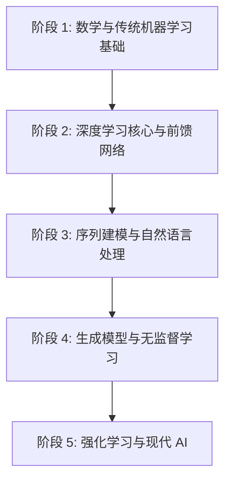

# 深度学习与人工智能循序渐进学习路径 (Learning Path)

本学习路径专为正在阅读 **AIMA (《人工智能：现代方法》)** 和 **花书 (《深度学习》)** 且处于起步阶段（目前在花书第 2 章：线性代数）的新人设计。

本路径结合了**理论学习**与本仓库内的**动手实践**，帮助你把书本上的数学公式与代码实现结合起来。

---

## 💡 给新人的核心建议

1. **不要被数学公式卡死**：花书（特别是前五章的数学基础和后半部分的理论证明）公式非常密集。第一遍阅读时，**以建立直觉和物理意义为主**，不要强求推导每一个公式，配合代码实现（如 NumPy 矩阵操作）能更快地理解其含义。
2. **理论与实践交替进行**：每看一章理论，就去写一写对应的简易代码。本仓库的结构正好为你提供了丰富的实践温床。
3. **现代工具链**：使用本项目已配置好的 `uv` 虚拟环境。在学习过程中，建议同时补充 Python 科学计算库（`numpy`, `pandas`, `matplotlib`）的使用技巧。

---

## 🗺️ 五阶段循序渐进学习路线图

---

### 📅 阶段 1：数学基础与传统机器学习 (预计 1.5 个月)
**目标**：打牢线性代数、概率与数值计算基础，理解机器学习的核心概念（过拟合、泛化、梯度下降）。

*   **理论阅读**：
    *   **花书**：第 2 章（线性代数）、第 3 章（概率与信息论）、第 4 章（数值计算）、第 5 章（机器学习基础）。
    *   **AIMA**：第 18 章（从样例中学习 - 决策树、线性回归、支持向量机基础）。
*   **核心关注点**：
    *   矩阵乘法、特征值分解、奇异值分解 (SVD) 的几何意义。
    *   极大似然估计 (MLE) 与最大后验估计 (MAP) 的区别。
    *   梯度下降（Gradient Descent）与条件数（Conditioning）。
    *   偏差-方差权衡（Bias-Variance Tradeoff）。
*   **动手实践**：
    1.  用 `numpy` 手写一个**线性回归**和**逻辑回归**，用随机梯度下降（SGD）进行参数更新。
    2.  练习使用本仓库中的 `[tools/tSNE.py](tools/tSNE.py)`，理解高维数据降维可视化的方法。

---

### 📅 阶段 2：前馈神经网络与深度学习核心 (预计 2 个月)
**目标**：理解多层感知机（MLP）和卷积神经网络（CNN）的基本原理，掌握前向传播与反向传播算法。

*   **理论阅读**：
    *   **花书**：第 6 章（深度前馈网络）、第 7 章（深度学习中的正则化）、第 8 章（深度模型中的优化）、第 9 章（卷积网络）。
    *   **AIMA**：第 18.7 节（人工神经网络）。
*   **核心关注点**：
    *   **反向传播（Backpropagation）**：链式法则在计算图上的流动，手推一个两层感知机的梯度。
    *   **激活函数**：ReLU、Sigmoid、Tanh 及其梯度消失/爆炸问题。
    *   **正则化**：L1/L2 正则化、Dropout、批归一化（Batch Normalization）。
    *   **优化算法**：Momentum、AdaGrad、RMSProp、Adam。
    *   **卷积操作**：感受野、步长（Stride）、填充（Padding）、通道（Channels）。
*   **动手实践**：
    1.  **深入学习本仓库的 [full_connect.py](full_connect.py)**：理解多层前馈网络、L2 正则化、Dropout 在神经网络中的具体实现。
    2.  阅读并实践 **`cv/`** 目录下的代码：
        *   运行 [cv/CNN.ipynb](cv/CNN.ipynb) 和 [cv/convnet.py](cv/convnet.py)，掌握卷积神经网络的构建。
        *   阅读关于 `ResNet` 和 `TransferLearning` (迁移学习) 的讲义，理解现代视觉模型的演进。

---

### 📅 阶段 3：序列模型与自然语言处理 (预计 1.5 个月)
**目标**：掌握处理时序数据与文本数据的循环神经网络（RNN / LSTM）及词向量技术。

*   **理论阅读**：
    *   **花书**：第 10 章（序列建模：循环和递归网络）。
    *   **AIMA**：第 22 章（自然语言处理）、第 23 章（自然语言的语言模型）。
*   **核心关注点**：
    *   循环神经网络（RNN）中的时间反向传播（BPTT）以及长距离依赖问题。
    *   **门控机制**：LSTM（长短期记忆网络）与 GRU（门控循环单元）的设计意图。
    *   **词向量（Word Embeddings）**：Skip-gram 与 CBOW 模型的数学原理。
    *   **Seq2Seq 与注意力机制（Attention）**：机器翻译的基础。
*   **动手实践**：
    1.  **词向量实践**：运行 [nlp/skipgram.py](nlp/skipgram.py) 和 [nlp/skipgram_cn.py](nlp/skipgram_cn.py)，体会如何将中文/英文文本转化为向量。
    2.  **文本生成实践**：阅读并运行 [nlp/lstm.py](nlp/lstm.py) 与 [nlp/lstm_cn.py](nlp/lstm_cn.py)，使用 LSTM 训练一个文本生成模型（如学习刘慈欣的小说风格）。
    3.  **NLP 综合应用**：探索 [nlp/autotriage/](nlp/autotriage)，了解如何将 NLP 预处理、NLTK 工具包与 LSTM 结合解决实际问题（自动分诊）。

---

### 📅 阶段 4：生成模型与无监督学习 (预计 1.5 个月)
**目标**：掌握自编码器与生成对抗网络（GAN），理解无监督学习的生成能力。

*   **理论阅读**：
    *   **花书**：第 14 章（自编码器）、第 20 章（深度生成模型 - 主要是 GAN 和 VAE 部分）。
*   **核心关注点**：
    *   **自编码器（Autoencoder）**：瓶颈层（Bottleneck）、去噪自编码器（DAE）。
    *   **生成对抗网络（GAN）**：生成器（Generator）与判别器（Discriminator）的极小化极大博弈（Minimax Game）。
    *   GAN 训练中的不稳定性与模式崩溃（Mode Collapse）。
*   **动手实践**：
    1.  **GAN 实践**：阅读并运行 [gan/dcgan_mnist.py](gan/dcgan_mnist.py)，观察生成器是如何从噪声中一步步生成手写数字图片的。
    2.  尝试修改该脚本，在其它简单数据集（如 FashionMNIST）上进行训练。

---

### 📅 5. 强化学习与现代人工智能 (预计 2 个月)
**目标**：理解智能体（Agent）如何在环境中通过奖惩进行学习，掌握经典强化学习与深度强化学习（DRL）入门。

*   **理论阅读**：
    *   **AIMA**：第 17 章（决策制定 - MDP 过程）、第 21 章（强化学习）。
    *   *注：花书对强化学习的介绍较少，建议以 AIMA 的强化学习章节作为理论主干。*
*   **核心关注点**：
    *   马尔可夫决策过程（MDP）：状态、动作、奖励、转移概率。
    *   值迭代（Value Iteration）与策略迭代（Policy Iteration）。
    *   **Q-Learning**：时间差分（TD）学习与探索-利用权衡（$\epsilon$-greedy）。
    *   深度 Q 网络（DQN）的基本思想（将神经网络作为 Q 函数逼近器）。
*   **动手实践**：
    1.  **经典 Q 学习**：阅读并运行 [rl/frozenLakeQ.py](rl/frozenLakeQ.py)，理解表格型 Q-learning 是如何解决冰湖寻路问题的。
    2.  **博弈强化学习**：阅读并探索 [rl/gobang/](rl/gobang)，理解智能体如何在棋盘对弈中评估局势和选取最优落子。

---

## 🛠️ 推荐的学习伴侣工具

*   **数学可视化网站**：[3Blue1Brown - 线性代数的本质](https://space.bilibili.com/8846162)（视频绝对必看）。
*   **交互式调试**：在运行本仓库的 Notebook 时（如 [tools/Keras.ipynb](tools/Keras.ipynb)），多用 `matplotlib` 画图展示中间特征，可以极大地辅助理解模型内部状态。
*   **PyTorch 迁移**：虽然本仓库中有很多早期的 TensorFlow (v1) 代码，但在你实际开发新项目时，强烈建议使用 **PyTorch** 重新实现它们，这会使你的工程能力和代码可读性得到极大提升。
